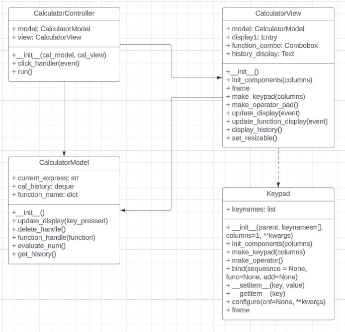

# Calculator Project
This project appears to be a simple calculator application implemented using Python and the Tkinter library for the graphical user interface (GUI). The calculator consists of a model (CalculatorModel), which handles the logic for evaluating expressions and maintaining a history of calculations, and a view (CalculatorView), which provides the user interface for inputting expressions and displaying results.

## How to run file
open the terminal and type `python main.py` or click run in main.py file